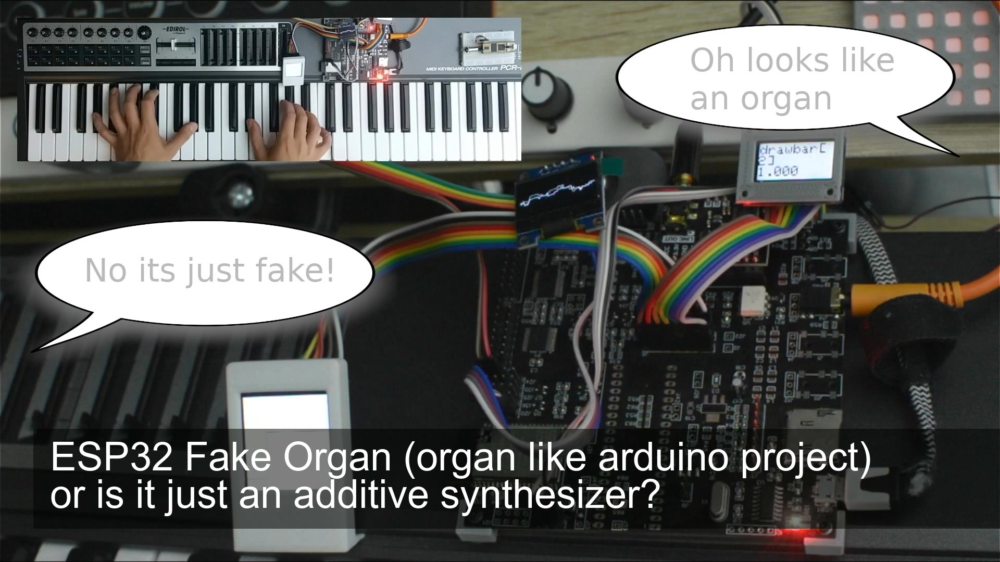

<h1 align="center">esp32_fake_organ</h1>
<h3 align="center">ESP32 Fake Organ (organ like arduino project) or is it just an additive synthesizer?</h3>  

 
   
  <a href="https://youtu.be/x4WEWTdZR90">link to the video</a>

---
<h2>Description</h2>
This project can be used as an organ-like instrument or also as a kind of additive synthesizer.
The design is completely different to the organ project but also capable of covering some important features.

---
The project has been tested on PCB ML v1 (ref: https://youtu.be/Lp65Urhy1-U)
It should be compatible with ESP32 Audio Kit and also easy to use with a stand-alone ESP32 with DIY hardware

---
Please feel free to share this project. 
In case of commercial purposes, get in touch with me (facebook, instagram, etc.)

## Features/Modules
### additive synth module
- 7 voies polyphone
- 9 oscillators per voice
- 5 simple waveforms (+ noise)
- decay setting per oscillator
- organ like percussion
- main low pass filter with variable cutoff and resonance

### delay effect
- variable delay length (max. 250ms)
- variable feedback
- controllable mix

### reverb effect (by YetAnotherElectronicsChannel)
- controllable wet/dry

### oled waveform display
- very stable waveform display based on a convolution algorithm
- supports 128x64 pixel display

### midi interface
- midi can be provided via uart (a dedicated connector on a real PCB)
- midi via serial port (allow rerouting signal via computer)
- midi via USB with additional hardware (not tested)

### supported codecs
- PCM5102a
- AC101
- ES8388

## Derived projects, contributions

Feel free to let me know if you made something new based on this project
If you have fixes, updates etc. you can generate a pull request